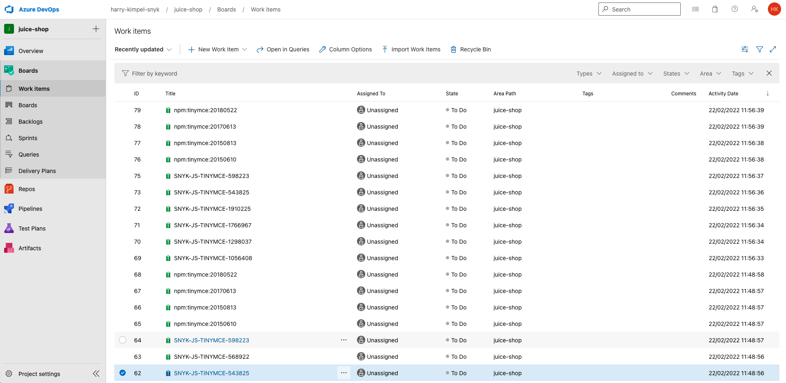
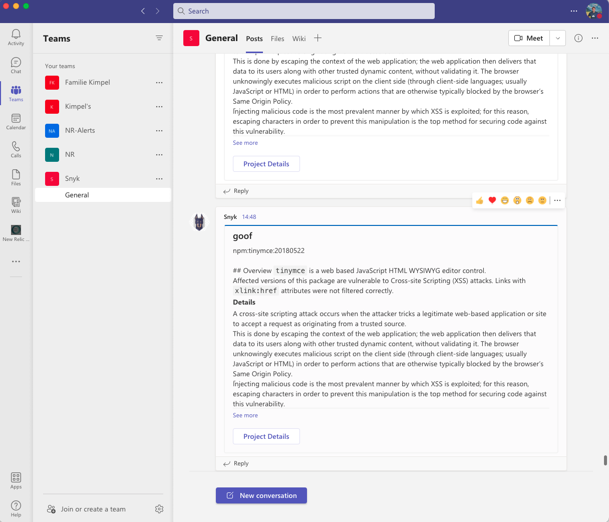
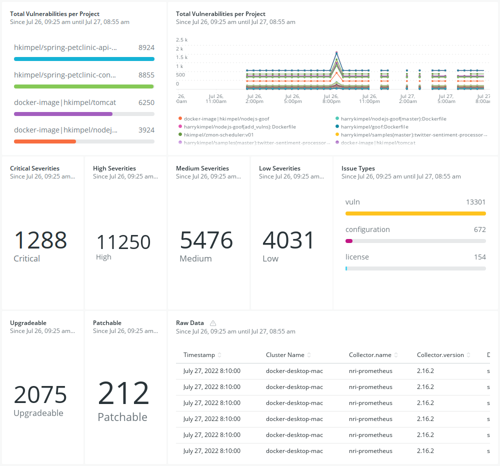
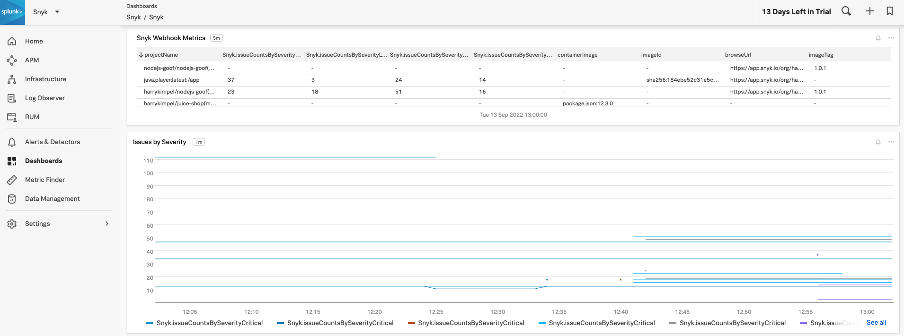

# Snyk webhook subscription

This repository contains some examples on how to subscribe to Snyk notifications and process the information in order to forward these notifications to Microsoft Teams or Azure DevOps Boards.

Please refer to the Snyk docs page for further information about Snyk Webhooks:
- [Snyk Webhook docs](https://docs.snyk.io/features/integrations/snyk-webhooks)
- [Snyk API docs](https://snyk.docs.apiary.io/#reference/webhooks)

Please also note that the webhooks feature is currently in beta. While in this status, Snyk may change the API and the structure of webhook payloads at any time, without notice.

Steps you need to follow in order to set-up this integration:

## 1. Create an Azure Function App in order to receive the webhook from Snyk

Samples provided include Azure Functions for:
-  [Azure DevOps Boards](azure-function-azure-boards.cs)
-  [Microsoft Teams](azure-function-microsoft-teams.cs)
-  [New Relic Events](azure-function-newrelic.cs)
-  [DataDog](azure-function-datadog.cs)
-  [Splunk Observability Cloud](azure-function-splunk.cs)

These are all written in C# in order to process the payload from Snyk and send it to an Azure DevOps Board.

This Azure Functions require the following environment variables to be set-up

### 1.1. Azure DevOps Boards work items to be created:


- AZURE_DEVOPS_ORG: the name of the Azure DevOps organisation
- AZURE_DEVOPS_PROJECT: the Azure DevOps project to create work items for
- AZURE_DEVOPS_USER: the Azure DevOps user name
- AZURE_DEVOPS_PAT: the Azure DevOps personall access token
- AZURE_DEVOPS_API_VERSION: the Azure DevOps API version to use, e.g. "7.1-preview.3"

For more information on how to create work items in Azure DevOps Boards, see this [docs page](https://docs.microsoft.com/en-us/rest/api/azure/devops/wit/work-items/create?view=azure-devops-rest-7.1).

### 1.2. Microsoft Teams messages:


- MS_TEAMS_WEBHOOK: the webhook connector for your Microsoft Teams channel

For more information on how to format messages for Microsoft Teams connectors, see this [docs page](https://docs.microsoft.com/en-us/microsoftteams/platform/webhooks-and-connectors/how-to/connectors-using?tabs=cURL).

### 1.3. New Relic events:


- NEW_RELIC_INSIGHTS_URL: URL for the New Relic accounts' event API, i.e. https://insights-collector.newrelic.com/v1/accounts/{NR-ACCOUNT-ID}/events
- NEW_RELIC_INSIGHTS_INSERT_KEY: New Relic Insights Insert Key

### 1.4. DataDog events:


- DATADOG_EVENTS_URL: URL for the DataDog event API, i.e. https://api.datadoghq.com/api/v1/events
- DATADOG_API_KEY: DataDog API Key

### 1.5. Splunk Observability Cloud metrics:


- SPLUNK_EVENTS_URL: URL for the Splunk datapoints API, i.e. https://ingest.us1.signalfx.com/v2/datapoint
- SPLUNK_ACCESS_TOKEN: Splunk Access Token

### 1.6. Gather Azure Function URL

Select the appropriate Azure Function and copy the Function URL (pls. find below an example for my New Relic Azure Function).


This is the URL you will need for the next step in order to create the Snyk Webhook.

## 2. Create a Snyk Webhook

```json
POST https://snyk.io/api/v1/org/{SNYK-ORG-ID}/webhooks HTTP/2
Host: snyk.io
Authorization: token {SNYK-TOKEN}
Content-Type: application/json

{
    "url": "https://{URL}",
    "secret": "my-secret-string"
}
```

As a result, you will get a response like this:

```json
{
  "id": "{SNYK-WEBHOOK-ID}",
  "url": "https://{URL}",
}
```

You could then use the Snyk Ping API in order to pro-actively trigger the webhook in order to test your integration:

```json
POST https://snyk.io/api/v1/org/{SNYK-ORG-ID}/webhooks/{SNYK-WEBHOOK-ID}/ping HTTP/2
Host: snyk.io
Authorization: token {SNYK-TOKEN}
Content-Type: application/json
```

## 3. Based on the notifications settings in your Snyk account, you will then be notified of new issues in your repositories

### 3.1. Azure DevOps Boards


### 3.2. Microsoft Teams


### 3.3. New Relic
- 
- 

### 3.4. DataDog


### 3.5. Splunk
